# Baja MRP System — System Design Document

> **Proyek:** Bukit Baja Anugrah — Material Requirements Planning (MRP)
> **Tech Stack:** PHP 5.x + MySQL 5.5 + Bootstrap 2.3.2 + jQuery + XAMPP

---

## Daftar Isi

1. [Use Case Diagram](#1-use-case-diagram)
2. [Sequence Diagrams](#2-sequence-diagrams)
3. [Domain Model](#3-domain-model)
4. [Entity Relationship Diagram (ERD)](#4-entity-relationship-diagram-erd)
5. [Data Flow Diagrams (DFD)](#5-data-flow-diagrams-dfd)
6. [Activity Diagrams](#6-activity-diagrams)
7. [Deployment Diagram](#7-deployment-diagram)
8. [Fitur Andalan: Hitung Modal Slitter](#8-fitur-andalan-hitung-modal-slitter)

---

## 1. Use Case Diagram

```mermaid
graph TD
    subgraph "Baja MRP System"
        %% Order Management
        UC1["Kelola Order Customer"]
        UC2["Input Bill of Materials"]
        UC3["Tutup Order"]

        %% Production
        UC4["Jadwalkan Produksi"]
        UC5["Eksekusi Job Produksi"]
        UC6["Catat Hasil QC Cutting"]
        UC7["Catat Downtime Mesin"]
        UC8["Monitoring Akumulator"]

        %% Slitting
        UC9["Buat Order Slitting"]
        UC10["Proses Slitter"]
        UC11["Catat Slit Coil MTS"]

        %% Plate
        UC12["Proses Plat MTS"]

        %% Packing
        UC13["Packing Produk"]
        UC14["Packing Pipa"]

        %% Inventory
        UC15["Kelola Stok Mother Coil"]
        UC16["Kelola Stok Slit Coil"]
        UC17["Kelola Stok Plat"]
        UC18["Kelola Stok Pipa"]
        UC19["Catat Mutasi Gudang"]

        %% Shipping
        UC20["Buat Surat Jalan"]
        UC21["Buat SJ Internal"]
        UC22["Buat SJ Pipa"]
        UC23["Proses Retur"]
        UC24["Catat Tanda Terima"]
        UC25["Kelola SJ Kosongan"]

        %% System
        UC26["Kelola Pengguna & Role"]
        UC27["Kelola Menu & Permission"]
        UC28["Kelola Master Data"]
        UC29["Generate Laporan"]
        UC30["Cetak / Export PDF/Excel"]
        UC31["Kelola Shift Kerja"]
        UC32["Kelola Sparepart"]

        %% Reporting
        UC33["Laporan Produksi"]
        UC34["Laporan Inventory"]
        UC35["Laporan Pengiriman"]

        %% Tools
        UC36["🔧 Hitung Modal Slitter"]
    end

    %% Actors
    ADMIN["👤 Admin / IT"]
    PPIC["👤 PPIC / Planner"]
    OPERATOR["👤 Operator Produksi"]
    QC["👤 QC Inspector"]
    GUDANG["👤 Staff Gudang"]
    SHIPPING["👤 Staff Pengiriman"]
    MANAGER["👤 Manajer"]
    PACKING["👤 Staff Packing"]

    %% Admin
    ADMIN --> UC26
    ADMIN --> UC27
    ADMIN --> UC28
    ADMIN --> UC31
    ADMIN --> UC32

    %% PPIC
    PPIC --> UC1
    PPIC --> UC2
    PPIC --> UC3
    PPIC --> UC4
    PPIC --> UC9
    PPIC --> UC10
    PPIC --> UC11
    PPIC --> UC36

    %% Operator
    OPERATOR --> UC5
    OPERATOR --> UC6
    OPERATOR --> UC7
    OPERATOR --> UC8
    OPERATOR --> UC12

    %% QC
    QC --> UC6
    QC --> UC8

    %% Gudang
    GUDANG --> UC15
    GUDANG --> UC16
    GUDANG --> UC17
    GUDANG --> UC18
    GUDANG --> UC19
    GUDANG --> UC13
    GUDANG --> UC14

    %% Packing
    PACKING --> UC13
    PACKING --> UC14

    %% Shipping
    SHIPPING --> UC20
    SHIPPING --> UC21
    SHIPPING --> UC22
    SHIPPING --> UC23
    SHIPPING --> UC24
    SHIPPING --> UC25

    %% Manager
    MANAGER --> UC29
    MANAGER --> UC30
    MANAGER --> UC33
    MANAGER --> UC34
    MANAGER --> UC35
```

### Aktor & Deskripsi

| Aktor | Deskripsi | Hak Akses |
|-------|-----------|-----------|
| **Admin / IT** | Mengelola sistem, pengguna, role, dan menu | `r,c,u,d` all modules |
| **PPIC / Planner** | Merencanakan order, produksi, slitting, dan kalkulasi | `r,c,u,d,approve` |
| **Operator Produksi** | Menjalankan produksi & input data QC, hitung modal slitter | `r,c,u` produksi |
| **QC Inspector** | Memvalidasi kualitas hasil produksi | `r,c,u` QC |
| **Staff Gudang** | Mengelola stok & mutasi inventory | `r,c,u` gudang |
| **Staff Packing** | Mencatat proses packing | `r,c,u` packing |
| **Staff Pengiriman** | Membuat surat jalan & kirim barang | `r,c,u,p` pengiriman |
| **Manajer** | Monitoring laporan & approval | `r,p,approve` all |

---

## 2. Sequence Diagrams

### 2.1 Order to Production Flow

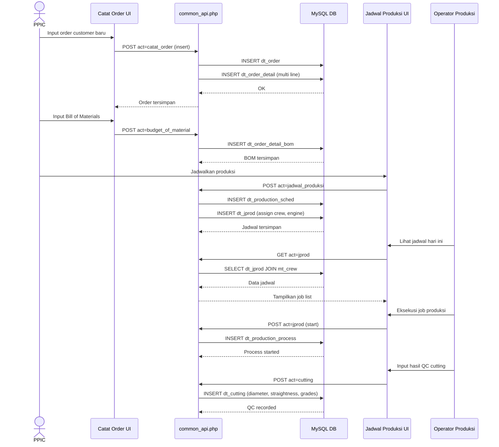

### 2.2 Slitting (Pemotongan Coil) Flow

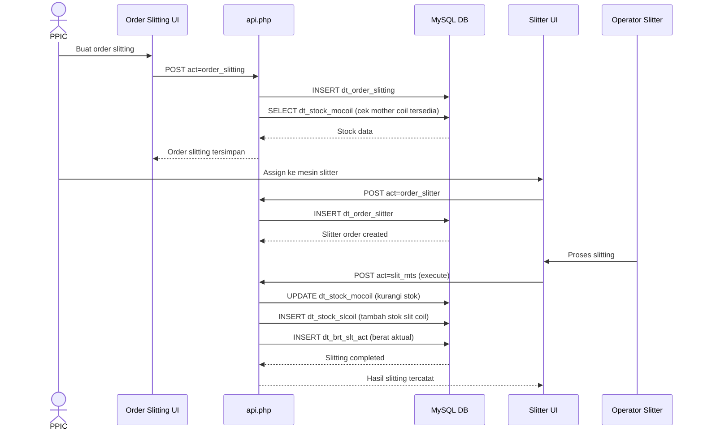

### 2.3 Shipping / Surat Jalan Flow

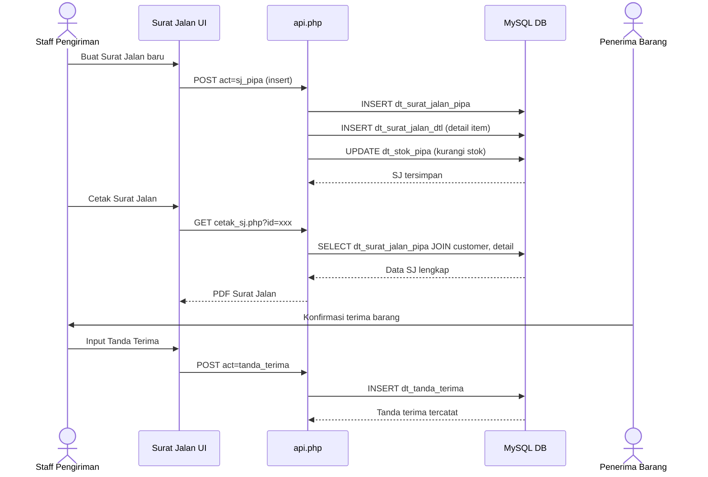

### 2.4 Hitung Modal Slitter (Cutting Optimization)

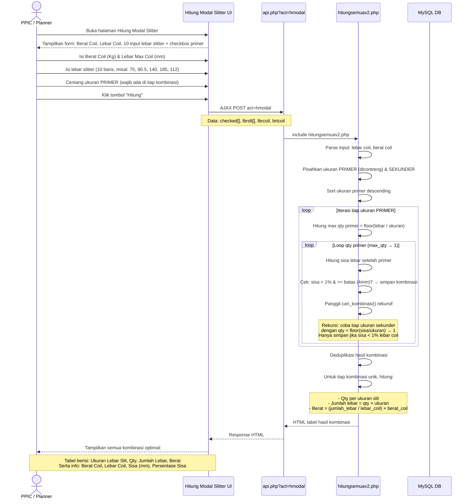

---

## 3. Domain Model

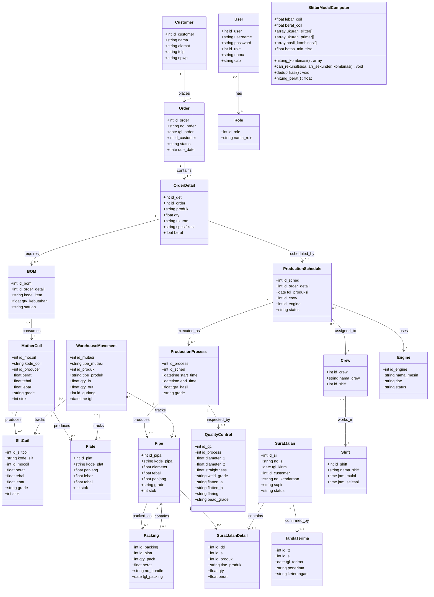

---

## 4. Entity Relationship Diagram (ERD)

```mermaid
erDiagram
    %% ── MASTER TABLES ──
    mt_customer {
        int id_customer PK
        varchar kode
        varchar nama
        text alamat
        varchar telp
        varchar npwp
        varchar contact_person
        tinyint del
    }

    mt_producer {
        int id_producer PK
        varchar kode
        varchar nama
        varchar negara
        tinyint del
    }

    mt_supplier {
        int id_supplier PK
        varchar kode
        varchar nama
        text alamat
        varchar telp
        tinyint del
    }

    mt_warehouse {
        int id_gudang PK
        varchar kode_gudang
        varchar nama_gudang
        varchar lokasi
        tinyint del
    }

    mt_crew {
        int id_crew PK
        varchar nama_crew
        varchar jabatan
        tinyint del
    }

    mt_engine {
        int id_engine PK
        varchar nama_mesin
        varchar tipe_mesin
        varchar kapasitas
        varchar status
        tinyint del
    }

    mt_sparepart {
        int id_sparepart PK
        varchar kode_part
        varchar nama_part
        int stok
        varchar satuan
        int id_supplier FK
        tinyint del
    }

    mt_cat_base {
        int id_cat_base PK
        varchar kode
        varchar nama_kategori
        tinyint del
    }

    %% ── USER & ROLE ──
    master_role {
        int id_role PK
        varchar nama_role
        varchar keterangan
    }

    pengguna {
        int id_user PK
        varchar username
        varchar password
        varchar nama_lengkap
        int id_role FK
        varchar cab
        varchar nip
        tinyint del
    }

    master_menu {
        int id_menu PK
        varchar nama_menu
        varchar url
        int parent_id
        int urutan
        varchar icon
        tinyint aktif
    }

    role_menu {
        int id PK
        int id_role FK
        int id_menu FK
        tinyint r
        tinyint c
        tinyint u
        tinyint d
        tinyint p
        tinyint approve
    }

    %% ── ORDER ──
    dt_order {
        int id_order PK
        varchar no_order
        date tgl_order
        int id_customer FK
        date due_date
        varchar status
        text keterangan
        varchar create_user
        datetime create_date
        varchar edit_user
        datetime edit_date
        tinyint del
    }

    dt_order_detail {
        int id_det PK
        int id_order FK
        varchar produk
        float qty
        varchar ukuran
        float tebal
        float panjang
        string spesifikasi
        float berat_per_unit
        float total_berat
        text keterangan
        tinyint del
    }

    dt_order_detail_bom {
        int id_bom PK
        int id_order_detail FK
        varchar kode_item
        float qty_kebutuhan
        string satuan
        int id_stock FK
        string tipe_stock
        tinyint del
    }

    %% ── STOCK ──
    dt_stock_mocoil {
        int id_mocoil PK
        varchar kode_coil
        int id_producer FK
        float berat
        float tebal
        float lebar
        float diameter_dalam
        string grade
        varchar no_po
        int stok
        varchar lokasi
        tinyint del
    }

    dt_stock_slcoil {
        int id_slcoil PK
        varchar kode_slit
        int id_mocoil FK
        float berat
        float tebal
        float lebar
        string grade
        int stok
        varchar lokasi
        tinyint del
    }

    dt_stock_plat {
        int id_plat PK
        varchar kode_plat
        int id_mocoil FK
        float panjang
        float lebar
        float tebal
        string grade
        int stok
        varchar lokasi
        tinyint del
    }

    dt_stok_pipa {
        int id_pipa PK
        varchar kode_pipa
        float diameter
        float tebal
        float panjang
        string grade
        float berat
        int stok
        varchar lokasi
        tinyint del
    }

    dt_stok_gudang {
        int id_mutasi PK
        string tipe_mutasi
        varchar no_ref
        int id_produk
        string tipe_produk
        float qty_in
        float qty_out
        float saldo
        int id_gudang FK
        datetime tgl_mutasi
        text keterangan
        tinyint del
    }

    %% ── PRODUCTION ──
    dt_production_sched {
        int id_sched PK
        int id_order_detail FK
        date tgl_produksi
        int id_crew FK
        int id_engine FK
        int id_shift FK
        float target_qty
        varchar status
        text catatan
        tinyint del
    }

    dt_production_process {
        int id_process PK
        int id_sched FK
        datetime start_time
        datetime end_time
        float qty_hasil
        float qty_reject
        string grade
        varchar status
        tinyint del
    }

    dt_jprod {
        int id_jprod PK
        int id_sched FK
        varchar no_jprod
        date tgl_jprod
        int id_crew FK
        int id_engine FK
        varchar status
        tinyint del
    }

    dt_jprod_item {
        int id_item PK
        int id_jprod FK
        int id_order_detail FK
        float qty_target
        float qty_hasil
        text catatan
        tinyint del
    }

    %% ── QUALITY CONTROL ──
    dt_cutting {
        int id_cutting PK
        int id_process FK
        float diameter_1
        float diameter_2
        float diameter_3
        float diameter_4
        float straightness
        string weld_surface
        string flatten_test_a
        string flatten_test_b
        string flaring_test
        string inside_bead
        float berat_actual
        float tebal_actual
        string grade_a_qty
        string grade_b_qty
        string grade_c_qty
        datetime tgl_qc
        tinyint del
    }

    dt_cutting_downtime {
        int id_downtime PK
        int id_process FK
        datetime start_downtime
        datetime end_downtime
        string penyebab
        text keterangan
        tinyint del
    }

    dt_accumulator {
        int id_accum PK
        int id_process FK
        float value_1
        float value_2
        float value_3
        datetime tgl_record
        tinyint del
    }

    dt_welding {
        int id_welding PK
        int id_process FK
        string tipe_weld
        float ampere
        float volt
        float speed
        datetime tgl_weld
        tinyint del
    }

    dt_speed {
        int id_speed PK
        int id_process FK
        float speed_value
        datetime tgl_record
        tinyint del
    }

    %% ── SLITTING ──
    dt_order_slitting {
        int id_slit PK
        varchar no_slitting
        date tgl_slitting
        int id_mocoil FK
        float berat_input
        float tebal
        float lebar
        varchar status
        tinyint del
    }

    dt_order_slitter {
        int id_slitter PK
        int id_slit FK
        int id_engine FK
        float berat_hasil
        float tebal_hasil
        float lebar_hasil
        int jumlah_potongan
        varchar grade
        tinyint del
    }

    dt_brt_slt_act {
        int id_brt PK
        int id_slitter FK
        float berat_actual
        datetime tgl_timbang
        tinyint del
    }

    %% ── PACKING ──
    dt_packing {
        int id_packing PK
        varchar no_packing
        date tgl_packing
        int id_produk
        string tipe_produk
        int qty_pack
        float berat_pack
        varchar no_bundle
        tinyint del
    }

    dt_packing_pipa {
        int id_pack_pipa PK
        int id_pipa FK
        int qty
        float berat
        varchar no_bundle
        varchar grade
        date tgl_packing
        tinyint del
    }

    dt_pak_baru {
        int id_pak_baru PK
        varchar no_packing
        date tgl_packing
        text items_json
        float total_berat
        varchar status
        tinyint del
    }

    %% ── SHIPPING ──
    dt_surat_jalan {
        int id_sj PK
        varchar no_sj
        date tgl_kirim
        int id_customer FK
        varchar no_kendaraan
        varchar nama_supir
        varchar status
        text keterangan
        tinyint del
    }

    dt_surat_jalan_pipa {
        int id_sj_pipa PK
        varchar no_sj
        date tgl_kirim
        int id_customer FK
        varchar no_kendaraan
        varchar nama_supir
        varchar status
        tinyint del
    }

    dt_surat_jalan_dtl {
        int id_dtl PK
        int id_sj FK
        int id_produk
        string tipe_produk
        float qty
        float berat
        string keterangan
        tinyint del
    }

    dt_sj_pipa {
        int id_sj PK
        varchar no_sj
        date tgl_sj
        int id_customer FK
        varchar no_kendaraan
        varchar supir
        varchar status
        tinyint del
    }

    dt_sj_pipa_dtl {
        int id_dtl PK
        int id_sj FK
        int id_pipa FK
        int qty
        float berat
        varchar no_bundle
        tinyint del
    }

    dt_sj_baru {
        int id_sj PK
        varchar no_sj
        date tgl_sj
        int id_customer FK
        varchar no_kendaraan
        varchar supir
        varchar tipe_barang
        text items_json
        varchar status
        tinyint del
    }

    dt_sj_kosongan {
        int id_kosong PK
        varchar no_sj
        date tgl_kosong
        varchar no_kendaraan
        varchar supir
        text keterangan
        tinyint del
    }

    dt_tanda_terima {
        int id_tt PK
        int id_sj FK
        date tgl_terima
        varchar nama_penerima
        varchar jabatan
        text keterangan
        varchar status
        tinyint del
    }

    %% ── SHIFT ──
    dt_shift {
        int id_shift PK
        varchar nama_shift
        time jam_masuk
        time jam_keluar
        tinyint del
    }

    dt_shift_crew {
        int id_sc PK
        int id_shift FK
        int id_crew FK
        date tgl_shift
        tinyint del
    }

    %% ── SYSTEM CONFIG ──
    form_entry_std {
        int id_form PK
        varchar nama_form
        varchar nama_tabel
        varchar page_title
        varchar path_save
        varchar path_list
        tinyint aktif
    }

    form_attr {
        int id_attr PK
        int id_form FK
        varchar nama_field
        varchar label
        varchar tipe_input
        varchar data_source
        int urutan
        tinyint required
        varchar validasi
    }

    form_list {
        int id_list PK
        int id_form FK
        varchar query_list
        varchar kolom_header
        varchar kolom_field
        int print_orientasi
        varchar print_judul
        varchar custom_php
    }

    sys_comp {
        int id_comp PK
        varchar nama_perusahaan
        text alamat
        varchar telp
        varchar fax
        varchar npwp
        blob logo
    }

    %% ── TOOLS ──

    %% ── RELATIONSHIPS ──

    %% Order chain
    mt_customer ||--o{ dt_order : "places"
    dt_order ||--o{ dt_order_detail : "has items"
    dt_order_detail ||--o{ dt_order_detail_bom : "requires BOM"
    dt_order_detail ||--o{ dt_production_sched : "scheduled as"

    %% BOM to Stock
    dt_order_detail_bom }o--|| dt_stock_mocoil : "consumes"

    %% Production
    dt_production_sched ||--o{ dt_production_process : "executed as"
    dt_production_sched ||--o{ dt_jprod : "job created"
    dt_jprod ||--o{ dt_jprod_item : "job items"
    dt_production_sched }o--|| mt_crew : "assigned crew"
    dt_production_sched }o--|| mt_engine : "uses machine"

    %% QC
    dt_production_process ||--o{ dt_cutting : "QC inspected"
    dt_production_process ||--o{ dt_cutting_downtime : "downtime"
    dt_production_process ||--o{ dt_accumulator : "measurements"
    dt_production_process ||--o{ dt_welding : "welding data"
    dt_production_process ||--o{ dt_speed : "speed data"

    %% Slitting
    dt_stock_mocoil ||--o{ dt_order_slitting : "slit into"
    dt_order_slitting ||--o{ dt_order_slitter : "slitter results"
    dt_order_slitter ||--o{ dt_brt_slt_act : "weight actual"
    dt_order_slitter }o--|| mt_engine : "uses machine"

    %% Stock flow
    dt_stock_mocoil ||--o{ dt_stock_slcoil : "produces"
    dt_stock_mocoil ||--o{ dt_stock_plat : "produces"
    dt_production_process ||--o{ dt_stok_pipa : "produces"

    %% Packing
    dt_stok_pipa ||--o{ dt_packing_pipa : "packed as"
    dt_stok_pipa ||--o{ dt_packing : "packed"

    %% Shipping
    mt_customer ||--o{ dt_surat_jalan : "receives"
    mt_customer ||--o{ dt_surat_jalan_pipa : "receives pipe"
    dt_surat_jalan ||--o{ dt_surat_jalan_dtl : "shipping details"
    dt_surat_jalan_pipa ||--o{ dt_sj_pipa_dtl : "pipe shipping"
    dt_surat_jalan ||--o{ dt_tanda_terima : "acknowledged"

    %% Warehouse
    mt_warehouse ||--o{ dt_stok_gudang : "stock movement"

    %% User & Role
    master_role ||--o{ pengguna : "has users"
    master_role ||--o{ role_menu : "permissions"
    master_menu ||--o{ role_menu : "menu access"

    %% Shift
    dt_shift ||--o{ dt_shift_crew : "crew assignment"

    %% Sparepart
    mt_supplier ||--o{ mt_sparepart : "supplies"
```

---

## 5. Data Flow Diagrams (DFD)

### 5.1 Context Diagram (Level 0)

```mermaid
graph TD
    CENTER["🏭 Baja MRP System<br/>Production & Inventory<br/>Management"]

    PPIC["PPIC / Planner"] -->|"Order, BOM, Schedule"| CENTER
    CENTER -->|"Jadwal Produksi, Status Order"| PPIC

    OPERATOR["Operator Produksi"] -->|"Hasil Produksi, QC Data, Downtime"| CENTER
    CENTER -->|"Job List, Target Produksi"| OPERATOR

    QC["QC Inspector"] -->|"Data Cutting, Grade, Akumulator"| CENTER
    CENTER -->|"Spec Standar, List QC Pending"| QC

    GUDANG["Staff Gudang"] -->|"Mutasi Stok, Penerimaan, Packing"| CENTER
    CENTER -->|"Level Stok, Lokasi Barang"| GUDANG

    SHIPPING["Staff Pengiriman"] -->|"Surat Jalan, Tanda Terima"| CENTER
    CENTER -->|"Order Siap Kirim, Daftar SJ"| SHIPPING

    MANAGER["Manajemen"] -->|"Request Laporan"| CENTER
    CENTER -->|"Laporan Produksi, Inventory, Pengiriman"| MANAGER

    ADMIN["Admin / IT"] -->|"Kelola User, Role, Master Data"| CENTER
    CENTER -->|"Konfirmasi Perubahan"| ADMIN

    CUSTOMER["Customer"] -->|"Konfirmasi Terima"| CENTER
    CENTER -->|"Surat Jalan, Invoice"| CUSTOMER
```

### 5.2 Level 1 DFD

```mermaid
graph TD
    subgraph "Baja MRP System - Level 1"
        P1["P1. Order Management"]
        P2["P2. Production Planning"]
        P3["P3. Production Execution"]
        P4["P4. Quality Control"]
        P5["P5. Slitting Processing"]
        P6["P6. Inventory Management"]
        P7["P7. Packing"]
        P8["P8. Shipping & Logistics"]
        P9["P9. Reporting"]
        P10["P10. System Admin"]
        P11["🔧 P11. Tools & Calculators"]

        D1[("D1: Master Data<br/>Customer, Supplier, Crew, Engine, etc.")]
        D2[("D2: Order Data<br/>Orders, Detail, BOM")]
        D3[("D3: Production Data<br/>Schedule, Process, JProd")]
        D4[("D4: QC Data<br/>Cutting, Welding, Accumulator")]
        D5[("D5: Inventory Data<br/>Mother Coil, Slit Coil, Plate, Pipe")]
        D6[("D6: Shipping Data<br/>Surat Jalan, Packing, Tanda Terima")]
        D7[("D7: User & Role Data")]
        D8[("D8: Warehouse Movement")]
    end

    PPIC2["PPIC"] --> P1
    PPIC2 --> P2
    PPIC2 --> P5

    OPERATOR2["Operator"] --> P3
    OPERATOR2 --> P4

    GUDANG2["Gudang"] --> P6
    GUDANG2 --> P7

    SHIPPING2["Shipping"] --> P8

    MANAGER2["Manager"] --> P9
    ADMIN2["Admin"] --> P10
    PPIC2 --> P11
    OPERATOR2["Operator"] --> P11

    P1 --> D1
    P1 --> D2
    P2 --> D2
    P2 --> D3
    P2 --> D1
    P3 --> D3
    P3 --> D5
    P4 --> D4
    P4 --> D3
    P5 --> D5
    P5 --> D1
    P6 --> D5
    P6 --> D8
    P7 --> D5
    P7 --> D6
    P8 --> D5
    P8 --> D6
    P8 --> D2
    P9 --> D2
    P9 --> D3
    P9 --> D4
    P9 --> D5
    P9 --> D6
    P9 --> D8
    P10 --> D7
    P10 --> D1
    P11 --> D5
    P11 --> D1
```

### 5.3 Data Stores Description

| Data Store | Description | Key Tables |
|-----------|-------------|------------|
| **D1: Master Data** | Reference/configuration data | `mt_customer`, `mt_producer`, `mt_supplier`, `mt_crew`, `mt_engine`, `mt_warehouse`, `mt_cat_base`, `mt_sparepart`, `sys_comp` |
| **D2: Order Data** | Customer orders & BOM | `dt_order`, `dt_order_detail`, `dt_order_detail_bom` |
| **D3: Production Data** | Schedules & execution | `dt_production_sched`, `dt_production_process`, `dt_jprod`, `dt_jprod_item` |
| **D4: QC Data** | Quality inspection results | `dt_cutting`, `dt_cutting_downtime`, `dt_accumulator`, `dt_welding`, `dt_speed` |
| **D5: Inventory Data** | All product stocks | `dt_stock_mocoil`, `dt_stock_slcoil`, `dt_stock_plat`, `dt_stok_pipa` |
| **D6: Shipping Data** | Delivery documents | `dt_surat_jalan`, `dt_surat_jalan_pipa`, `dt_sj_pipa`, `dt_sj_baru`, `dt_tanda_terima`, `dt_packing_pipa`, `dt_pak_baru` |
| **D7: User & Role Data** | Authentication & authorization | `pengguna`, `master_role`, `master_menu`, `role_menu` |
| **D8: Warehouse Movement** | Inventory mutations | `dt_stok_gudang` |

---

## 6. Activity Diagrams

### 6.1 Full Production Order-to-Ship Activity Flow

```mermaid
flowchart TD
    START(["📋 Start: Customer Order Diterima"]) --> A1

    subgraph ORDER["1. ORDER MANAGEMENT"]
        A1["Input Order Customer"]
        A2["Input Detail Order (Item, Qty, Spec)"]
        A3["Input Bill of Materials"]
        A4{"Stok Tersedia?"}
        A5["Buat PO / Procurement"]
        A6["Order Disetujui"]
    end

    A1 --> A2
    A2 --> A3
    A3 --> A4
    A4 -->|"Tidak"| A5
    A5 --> A6
    A4 -->|"Ya"| A6

    subgraph PLANNING["2. PRODUCTION PLANNING"]
        B1["Jadwalkan Produksi"]
        B2["Assign Crew & Shift"]
        B3["Assign Mesin/Engine"]
        B4["Buat Job Production (JProd)"]
    end

    A6 --> B1
    B1 --> B2
    B2 --> B3
    B3 --> B4

    subgraph EXECUTION["3. PRODUCTION EXECUTION"]
        C1["Operator Lihat Job List"]
        C2["Start Proses Produksi"]
        C3["Catat Data Proses (Speed, Weld)"]
        C4{"Ada Downtime?"}
        C5["Catat Downtime"]
        C6["Catat Hasil Akumulator"]
        C7["Selesai Produksi"]
    end

    B4 --> C1
    C1 --> C2
    C2 --> C3
    C3 --> C4
    C4 -->|"Ya"| C5
    C5 --> C3
    C4 -->|"Tidak"| C6
    C6 --> C7

    subgraph QC_PROCESS["4. QUALITY CONTROL"]
        D1["Ukur Diameter (4 Titik)"]
        D2["Ukur Kelurusan (Straightness)"]
        D3["Cek Permukaan Las"]
        D4["Flattening Test A & B"]
        D5["Flaring Test"]
        D6["Cek Inside Bead"]
        D7["Timbang Berat Aktual"]
        D8["Tentukan Grade (A/B/C)"]
        D9{"Grade OK?"}
        D10["Produk Masuk Stok Pipa"]
        D11["Produk Reject / Rework"]
    end

    C7 --> D1
    D1 --> D2
    D2 --> D3
    D3 --> D4
    D4 --> D5
    D5 --> D6
    D6 --> D7
    D7 --> D8
    D8 --> D9
    D9 -->|"Grade A/B"| D10
    D9 -->|"Grade C/Reject"| D11

    subgraph PACKING_PROCESS["5. PACKING"]
        E1["Ambil Produk dari Stok"]
        E2["Buat Bundle/Pack"]
        E3["Timbang Berat Bundle"]
        E4["Assign No Bundle"]
        E5["Catat Packing"]
    end

    D10 --> E1
    E1 --> E2
    E2 --> E3
    E3 --> E4
    E4 --> E5

    subgraph SHIPPING_PROCESS["6. SHIPPING"]
        F1["Buat Surat Jalan"]
        F2["Pilih Produk & Bundle"]
        F3["Input No Kendaraan & Supir"]
        F4["Cetak SJ (PDF)"]
        F5["Kirim Barang"]
        F6["Customer Terima"]
        F7["Input Tanda Terima"]
    end

    E5 --> F1
    F1 --> F2
    F2 --> F3
    F3 --> F4
    F4 --> F5
    F5 --> F6
    F6 --> F7

    END(["✅ End: Order Complete"])
    F7 --> END
```

### 6.2 Slitting Process Activity

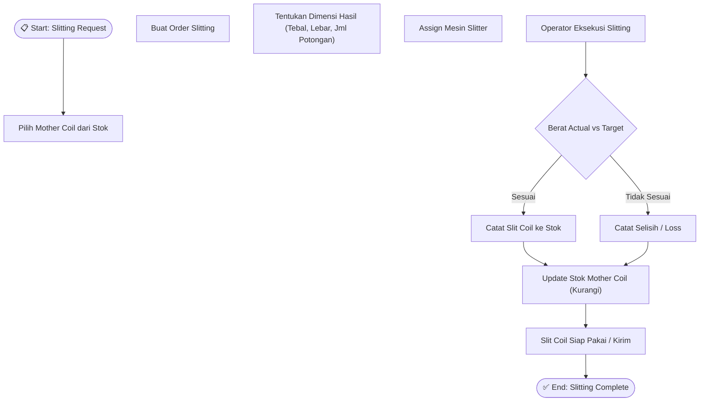

### 6.3 Inventory Movement Activity

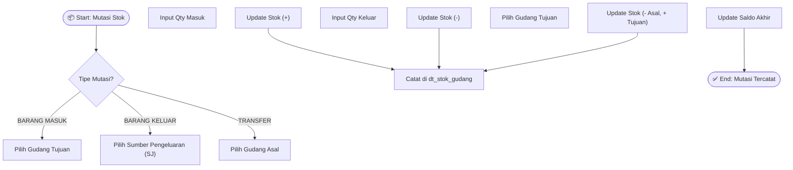

### 6.4 Hitung Modal Slitter (Cutting Optimization)

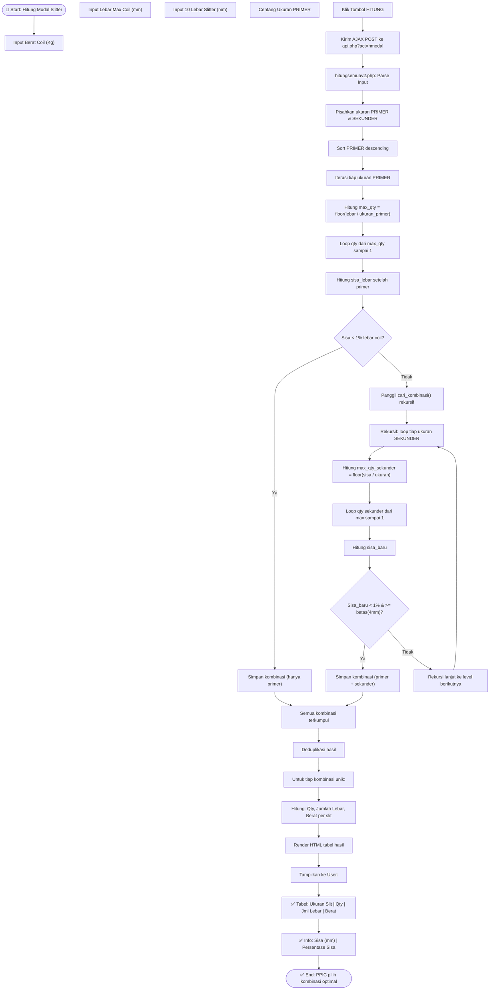

---

## 7. Deployment Diagram

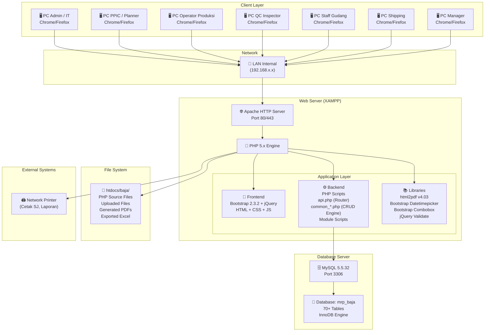

### Deployment Stack Detail

| Layer | Component | Version | Purpose |
|-------|-----------|---------|---------|
| **OS** | Windows | - | Server operating system |
| **Web Server** | Apache (XAMPP) | 2.x | HTTP request handling |
| **Runtime** | PHP | 5.x | Server-side scripting, recursive calc engine |
| **Database** | MySQL | 5.5.32 | Data persistence |
| **Frontend** | Bootstrap + jQuery | 2.3.2 | Responsive UI, AJAX calculator |
| **PDF** | html2pdf | 4.03 | Document generation |
| **Network** | LAN Internal | TCP/IP | Intranet access only |

### Network Architecture Notes

```
┌─────────────────────────────────────────────────────────┐
│                   INTERNAL LAN (192.168.x.x)             │
│                                                          │
│  ┌──────────┐  ┌──────────┐  ┌──────────┐               │
│  │  Admin   │  │  PPIC    │  │ Operator │  ...          │
│  │  PC      │  │  PC      │  │  PC      │               │
│  └────┬─────┘  └────┬─────┘  └────┬─────┘               │
│       │              │              │                     │
│       └──────────────┼──────────────┘                     │
│                      │                                    │
│              ┌───────┴───────┐                            │
│              │  XAMPP Server │                            │
│              │  Apache:80    │                            │
│              │  MySQL:3306   │                            │
│              │  PHP 5.x      │                            │
│              │  ┌──────────┐ │                            │
│              │  │hmodal    │ │  ◀── Slitter Calculator   │
│              │  │Engine v2 │ │      hitungsemuav2.php    │
│              │  └──────────┘ │                            │
│              └───────────────┘                            │
│                      │                                    │
│              ┌───────┴───────┐                            │
│              │  Network       │                            │
│              │  Printer       │                            │
│              └───────────────┘                            │
└─────────────────────────────────────────────────────────┘
```

---

## 8. Fitur Andalan: Hitung Modal Slitter

### Deskripsi

**Hitung Modal Slitter** adalah *cutting optimization calculator* yang digunakan PPIC/Operator untuk menghitung kombinasi pemotongan mother coil yang paling optimal dengan meminimalkan sisa (waste < 1%).

### Komponen

| File | Peran |
|------|-------|
| `modul/tool/hitung_modal_slitter.php` | **Frontend UI** — Form input berat coil, lebar coil, 10 baris lebar slitter + checkbox primer, tombol Hitung, AJAX POST |
| `api.php` (case `hmodal`) | **Router** — Menerima request `act=hmodal`, meneruskan ke engine |
| `modul/tool/hitungsemuav2.php` | **Calculation Engine v2** — Algoritma rekursif kombinatorial untuk mencari semua kemungkinan potongan optimal |

### Alur Kerja

```
┌─────────────────────────────────────────────────────────┐
│  INPUT                                                  │
│  ─────                                                  │
│  Berat Coil    : 5000 Kg                                │
│  Lebar Coil    : 1250 mm                                │
│  Ukuran Slitter: [75, 90.5, 140, 185, 112, ...] (10x)  │
│  Primer (✓)    : [140, 185]  ← wajib ada di hasil      │
└─────────────────────────────────────────────────────────┘
                          │
                          ▼
┌─────────────────────────────────────────────────────────┐
│  ALGORITMA (hitungsemuav2.php)                          │
│  ─────────────────────────                              │
│  1. Pisahkan ukuran PRIMER vs SEKUNDER                  │
│  2. Sort PRIMER descending                              │
│  3. Untuk tiap PRIMER:                                  │
│     - Hitung max_qty = floor(1250 / ukuran)             │
│     - Loop qty dari max → 1                             │
│     - Hitung sisa setelah primer                        │
│     - Jika sisa < 1% → simpan kombinasi                 │
│     - Jika tidak → rekursi cari_kombinasi()             │
│  4. Rekursi: coba tiap SEKUNDER dengan qty menurun      │
│     - Hanya simpan jika sisa < 1% & >= 4mm              │
│  5. Deduplikasi semua hasil                              │
│  6. Hitung berat per slit = (lebar_slit/lebar_coil)     │
│     × berat_coil                                        │
└─────────────────────────────────────────────────────────┘
                          │
                          ▼
┌─────────────────────────────────────────────────────────┐
│  OUTPUT (HTML Table)                                    │
│  ──────                                                 │
│  Berat Coil   : 5,000.00 Kg                             │
│  Lebar Coil   : 1,250.00 mm                             │
│  Sisa         : 3.00 mm                                 │
│  Persentase   : 0.24 %                                  │
│                                                         │
│  ┌────────────┬─────┬──────────────┬────────────┐       │
│  │ Ukuran Slit│ Qty │ Jumlah Lebar │ Berat (Kg) │       │
│  ├────────────┼─────┼──────────────┼────────────┤       │
│  │ 185        │ 4   │ 740          │ 2,960.00   │       │
│  │ 140        │ 3   │ 420          │ 1,680.00   │       │
│  │ 90.5       │ 1   │ 90.5         │ 362.00     │       │
│  └────────────┴─────┴──────────────┴────────────┘       │
│  TOTAL                         1,250.5 mm   5,002.00 Kg │
└─────────────────────────────────────────────────────────┘
```

### Keunggulan Fitur

| Aspek | Deskripsi |
|-------|-----------|
| **Optimasi Waste** | Mencari kombinasi dengan sisa < 1% lebar coil |
| **Prioritas Primer** | Ukuran yang dicentang WAJIB muncul di setiap hasil |
| **Eksplorasi Lengkap** | Algoritma rekursif mencoba SEMUA kombinasi yang mungkin |
| **Real-time** | AJAX-based, hasil langsung muncul tanpa reload halaman |
| **Akurasi Berat** | Berat dihitung proporsional berdasarkan lebar slit vs lebar coil |
| **Deduplikasi** | Hasil bersih tanpa kombinasi duplikat |

### Kompleksitas Algoritma

- **Worst case:** O(n! × m) di mana n = jumlah ukuran sekunder, m = max qty per ukuran
- **Optimasi:** Batas sisa 4mm dan threshold 1% memangkas banyak cabang rekursi
- **Pembatasan:** Maksimal 10 input ukuran slitter, hasil difilter sisa < 1%

---

## 8. Summary of Key Design Patterns

### Architecture Patterns

| Pattern | Implementation |
|---------|---------------|
| **Front Controller** | `api.php` acts as single entry point routing based on `act` parameter (including `hmodal`) |
| **Data-Driven UI** | `form_entry_std`, `form_attr`, `form_list` tables define form behavior at runtime |
| **Recursive Combinatorial** | `hitungsemuav2.php` uses depth-first recursive search for cutting optimization |
| **Soft Delete** | All tables use `del` (TINYINT) flag, never hard deletes |
| **Audit Trail** | Every record has `create_user`, `create_date`, `edit_user`, `edit_date` |
| **RBAC** | Role-Based Access Control via `master_role` → `role_menu` with `r,c,u,d,p,approve` permissions |
| **Module-Based Structure** | Each business domain in `modul/[module_name]/` with isolated scripts |

### API Routing Pattern

```
Request: api.php?act={module}&sub={action}&args...
         │
         ▼
    api.php (Router - switch/case)
         │
         ├── Module CRUD:  include modul/{module}/common_api.php
         │         │
         │         ▼
         │    Handle CRUD: insert, update, delete, get, list, print
         │         │
         │         ▼
         │    JSON Response
         │
         └── Special act=hmodal: include modul/tool/hitungsemuav2.php
                   │
                   ▼
              Recursive combinatorial search → HTML Table Response
```

### Database Conventions

- **Master tables** prefixed with `mt_` (e.g., `mt_customer`, `mt_crew`)
- **Detail/transaction tables** prefixed with `dt_` (e.g., `dt_order`, `dt_surat_jalan`)
- **System tables** prefixed with `sys_` or `master_` (e.g., `sys_comp`, `master_role`)
- **All tables** have `del` TINYINT(1) DEFAULT 0 for soft delete
- **All transaction tables** have audit columns

---

> **Dibuat oleh Giant R J**
